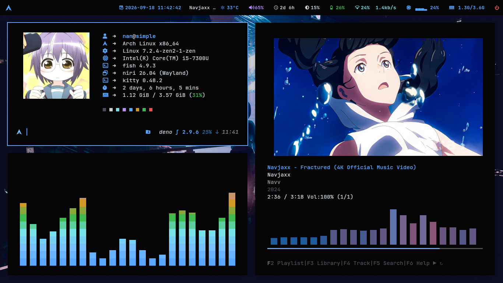
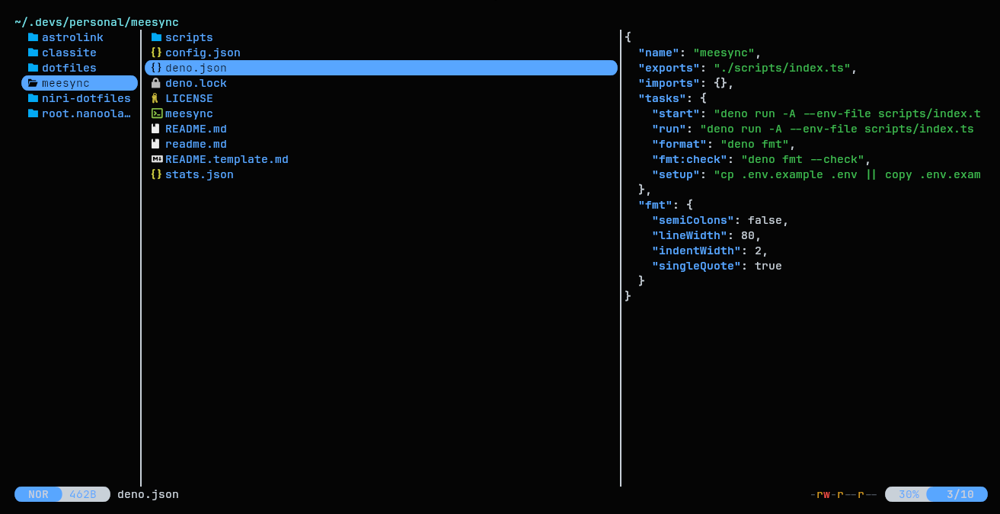

# Cyan Rice Niri Dotfiles

> Personal dotfiles for **Niri** (Wayland compositor) on Arch Linux cyan-theme, minimal, aesthetic.

## Screenshots

<details>
<summary>Interface & Menus</summary>
<br>


</details>

<details>
<summary>TUI & Apps</summary>
<br>




</details>

## Stack

| Domain | App |
|--------|-----|
| Window Manager | Niri |
| Shell | Fish + Starship |
| Terminal | Kitty |
| Launcher | wofi |
| Status Bar | Waybar |
| Editor | Neovim (LazyVim) |
| Notifications | Dunst |
| File Manager | Yazi |
| Lock Screen | Swaylock |

## Directory Structure

```
config/
├── alacritty/        # Terminal emulator
├── btop/             # System monitor
├── cava/             # Audio visualizer
├── dunst/            # Notifications
├── fastfetch/        # System fetch
├── fish/             # Shell config (conf.d/, functions/)
├── kitty/            # Terminal
├── lsd/              # LS colors
├── niri/             # WM config (modules/)
├── nvim/             # Neovim (LazyVim)
├── shell/            # Shared POSIX aliases/functions
├── swaylock/         # Lock screen
├── theme/            # Cyan color palette
├── waybar/           # Status bar
├── wofi/             # App launcher
└── yazi/             # File manager
```

## Keybinds

| Key | Action |
|-----|--------|
| Mod + Return | Kitty |
| Mod + D | wofi launcher |
| Mod + N | Kitty nvim |
| Mod + Q | Close window |
| Mod + F | Maximize column |
| Mod + V | Toggle floating |
| Mod + O | Toggle overview |
| Mod + 1-9 | Switch workspace |
| Mod + Shift + 1-9 | Move to workspace |
| Mod + P | Powermenu |
| Mod + . | Expel window from column |
| Mod + Space | Consume column |
| Mod + BracketLeft/Right | Consume/expel |
| Mod + Shift + W | Random wallpaper |
| Mod + Shift + E | Emoji picker |
| Mod + Shift + N | Notification center |
| Super + Shift + L | Lock screen |
| Mod + Shift + P | Power-off monitors |

## Credits

Based on [aadnanmt/hyprland-dotfiles](https://github.com/aadnanmt/hyprland-dotfiles) — refactored from Hyprland to Niri WM.

- **[elifouts (Dotfiles)](https://github.com/elifouts/Dotfiles):** Wofi configs, Powermenu.
- **[dln (wofi-emoji)](https://github.com/dln/wofi-emoji):** Emoji selector.
- **[victordantasdev/waybar](https://github.com/victordantasdev/waybar):** Waybar base config.
- **[LazyVim](https://www.lazyvim.org/):** Neovim framework.
- **[Niri](https://github.com/YaLTeR/niri):** Wayland compositor.
- **Arch Linux:** Foundation.

## License

GPL-3.0
